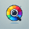

<div align="center">
  
# Color Picker



### Effortless Color Identification

[](LICENSE)
[](CONTRIBUTING.md)

</div>

---

## 🚀 Overview

Color Picker is a handy Chrome extension designed for developers, designers, and anyone working with colors. Instantly identify and extract color values in multiple formats, including RGB and Hex, with a simple click.

## ✨ Key Features

- 🎨 **Color Identification**: Get RGB and Hex values of any color on your screen.
- 🖱️ **Easy to Use**: Intuitive interface with a simple click-to-pick functionality.
- ⚡ **Quick Copy**: Copy color codes to your clipboard instantly.
- 🔍 **Precision Picking**: Ensures accurate color detection on any webpage.

## 📦 Perfect For

- 🖌️ Web designers and developers.
- 🎨 Graphic artists.
- 🛠️ Anyone needing quick access to color information.

## 🛠️ Installation

### Method 1: Chrome Web Store
Coming soon!

### Method 2: Manual Installation

1. **Get the Code**
   ```bash
   [https://github.com/vaibhavraj072/color_picker]
